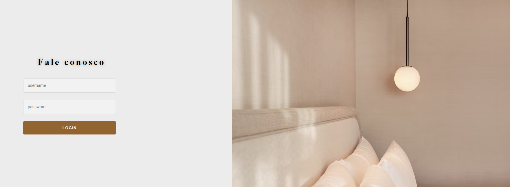
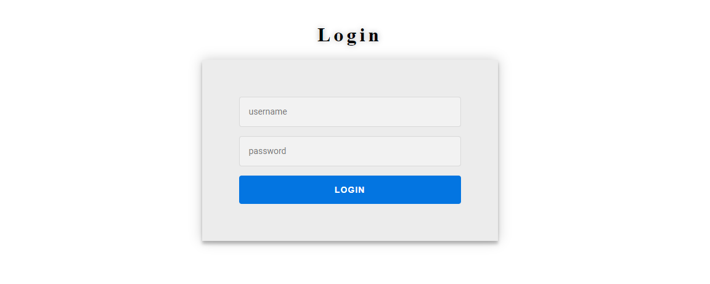

# Componentes em CSS de sites
Desenvolvidos no https://codepen.io/

### Menu
<h2 align="center">
  
</h2>

### Footer
<h2 align="center">
  
</h2>

## Form
<h2 align="center">
  
</h2>

## Form básico 
<h2 align="center">
  
</h2>